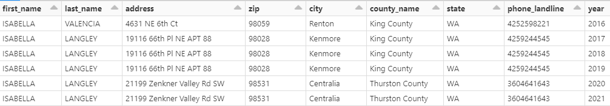
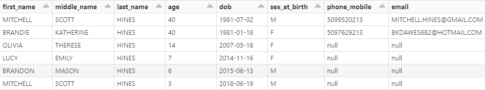
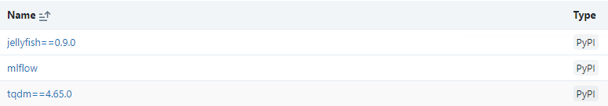

# synthetic-gold

## 1. Background

### 1.1 Introduction
Record linkage is a complex process and is utilized to some extent in nearly every organization that works with modern human data records.
People create methods for linking records on a case-by-case basis.
Some may use basic matching between record 1 and record 2 as seen below
```python
### Pseudo-Code!
if (r1.FirstName == r2.FirstName) & (r1.LastName == r2.LastName):
  out.match = True
else:
  out.match = False
```
while others may choose to create more complex decision trees or even machine learning approaches to record linkage.

When people approach record linkage via machine learning (ML), they can match on a variety of fields, typically dependent on the forms used to collect data.
While these ML-utilized fields can vary on a organization-to-organization level, there are several fields that appear more frequently than others. 
They are as follows:
* First Name
* Middle Name
* Last Name
* Date of Birth
* Sex at Birth
* Race
* SSN (maybe)
* Address house
* Address zip
* Address city
* Address county
* Address state
* Phone
* Email
* Date Data Submitted

By comparing two records on all of these fields, ML record linkage models use complex logic to make the "Yes" or "No" decision on whether 2 records reflect the same individual.
Record linkage can become difficult when individuals change addresses, adopt new last name, erroneously fill out data, or have information that closely resembles another individual (ex: twins).

### 1.2 The Problem
As described above, record linkage can have many complex elements to it.  
Consider a situation where you are manually reviewing 2 records.
These two records only contain basic information on the individuals and you are tasked to decide if Record #1 and Record #2 belong to the same person.

| Record # | First Name | Last Name | Sex |  DOB | Address | Address ZIP | Address State | Phone | Date Received | 
| :--- | :----: | :----: | :----: | :----: | :----: | :----: | :----: | :----: | ---: | 
| 1 | Isabella | Valencia | F |  1992-09-13 | 4631 NE 6th Ct | 98059 | WA | (425)-259-8221 | 2016-03-01 | 
| 2 | Izzy | Langley |  |  1992-09-13 | 2199 Zenkner Valley Rd SW | 98531 | WA | +1 (360)-464-1643 | 2021-06-30 | 

At a glance, these records are significantly different and you should therefore mark them as different persons.
For the purposes of record linkage manual review, you probably made the correct decision.
After all, for record linkage, most models prefer False Negatives to False Positives.

When groups validate record linkage models, they often turn to manually-reviewed record comparisons as their "gold-standard".
There are two separate marks of judgement for record linkage that I would like us to consider
1.  Creating a model that simulates a human's decision making process 
2.  Creating a model that seeks a deeper record equality "Truth" 

I believe many groups aim for and are content with accomplishing goal #1.
That approach is unarguably useful.
However, I believe that it can be harmful in biases that it introduces.
For example, it is biased against people who adopt new last names upon marriages/civil unions (more often "Female" Sex at Birth).
Models that bias against non-american names can also produce high validation marks, but are flawed nonetheless.
Consider the 2 records displayed earlier.
There is a real chance that Wanda adopted a new last name and moved in the 6 years between when the data was collected.

Without relevant documentation (birth, marriage, ... , housing records), we have no way of knowing whether or not "Isabella Valencia" is the same person as "Izzy Langley".
It follows that treating manual review as a "gold-standard" fails to completely support goal #2.

### 1.3 The Solution
We hope to create a simulated society that can be used as absolute truth.
The simulated society will be built to reflect the population of a given state of interest (ie: Washington State).
This will have a relational-database type structure with tables containing all relevant supporting structures for record linkage such as:
* birth records
* partnership (marriage) records
* moving records

We hope to create a society with representative and diverse names, representative demographic breakdowns, and representative geographic population densities.
The structure of the database will allow for "Time Travel" queries that allow a user to capture all data from a specific year in time.

By creating a simulated society, we will have absolute truth in determining whether record1 = record2.
This approach will give us an opportunity to assess record linkage models considering goal #2.

### 1.4 Examples

Note that the examples below are hand-picked outputs of the simulation for Washington State.
All records are synthetic and **ARE IN NO WAY** connected to protected patient data.
Only public sources were used to create them. 


*A female individual from 2016-2021.
Note that across time she changes last name, address, and landline several times.
Note these fields do not encompass all available fields.
They were chosen specifically to convey changing person identifiers over time.*


*A family living together, snapshot taken in 2021.
Note that there is a family name passed down, MITCHELL SCOTT HINES.
This is one of the elements that can make record linkage difficult.*


---------------------------------
---------------------------------
---------------------------------

## 2. User Instructions

### 2.1 Prerequisites

In order to run this process to completion, the following are all assumed:

* *Github* - User has cloned this repository to their local computer.  User has copied local repo folder into cloud location (see *Cloud Interaction* below)
* *Local Interaction* - Python is installed and you can run Jupyter notebooks locally. See below for recommended downloads if uninstalled:
  * [Python download link](https://www.python.org/downloads/)
  * [Visual Studio Code download link](https://code.visualstudio.com/download) - An integrated development environment (IDE) for interacting with python and jupyter notebook. Anaconda works as well.
  * [Databricks information link](https://azure.microsoft.com/en-us/free/databricks/search/?ef_id=_k_Cj0KCQjw2qKmBhCfARIsAFy8buJj4WHbvMHdVNnGGzBv64Js-j29Wl0Z_XQYNal_Oji-D0io-AEY7HwaAgslEALw_wcB_k_&OCID=AIDcmm5edswduu_SEM__k_Cj0KCQjw2qKmBhCfARIsAFy8buJj4WHbvMHdVNnGGzBv64Js-j29Wl0Z_XQYNal_Oji-D0io-AEY7HwaAgslEALw_wcB_k_&gad=1&gclid=Cj0KCQjw2qKmBhCfARIsAFy8buJj4WHbvMHdVNnGGzBv64Js-j29Wl0Z_XQYNal_Oji-D0io-AEY7HwaAgslEALw_wcB) - This is a commercial software that costs money per compute per time. However, I believe that you have 14 days of free compute.
* *Cloud Interaction* - You have access to Databricks and some type of cloud data storage. Compute gets rather large for some scripts and requires databricks/pyspark to run.

If you do not have access to databricks, may see this project but will be unable to run all of the code in regular .py files without hitting memory errors.
Also, the regular .py python files, almost all of which were created in databricks, may have odd formatting (ie: %magic, %md, %run) that will not translate to a local IDE such as VS Code or Anaconda. 

### 2.2 Basic Setup

1. *Config* - As mentioned above, please clone this Github Repo to your local computer.

2. *Config* - Copy the contents of that folder and copy it into your cloud data storage location (ie: databricks data or azure storage explorer). This will allow you to access a handful of .csv files already initialized as well as provide the infrastructure for saving data.

3. *Config* - If not already configured, you'll need to configure databricks github repo compatibility. [See link here](https://docs.databricks.com/repos/repos-setup.html). This will allow you to interact with Github via Databricks>Workspace>Repos

4. *Config* - Once the Databricks Repos has been configured, please clone the Github Repo to databricks. This is how you'll access the python scripts that require databricks to run.

5. *Local Venv* - Create a python virtual environment from the requirements.txt file in the repo.  Command prompt steps listed below from [stack overflow explanation](https://stackoverflow.com/questions/41427500/creating-a-virtualenv-with-preinstalled-packages-as-in-requirements-txt):

    * `git clone <repo>`
    * `cd <repo>`
    * `pip install virtualenv` (if you don't already have virtual env installed)
    * `virtualenv venv` to create your new environment (called 'venv' here)
    * `source venv/bin/activate` to enter the virtual environment
    * `pip install -r requirements.txt` to install the requirements in the current environment

6. *Databricks Cluster* - You will need to configure a databricks cluster to perform your compute.  See below for specs I used to run scripts and the process.

    **Configuration**

    * Policy - `Unrestricted`
    * Access mode - `Single user`
    * Databricks Runtime Version - `12.2 LTS` (includes Apache Spark 3.3.2, Scala 2.12)
    * Use Photon Acceleration - `checked`
    * Worker type - `Standard_D16ds_v4` (64 GB Memory, 16 cores)
    * Min workers - `2`
    * Max workers - `6`
    * Driver type - `Standard_D16ds_v4` (same as worker)
    * Enable autoscaling - `checked`
    * Terminate after ___ minutes of inactivity - `120` (super subjective)
    * Advanced options
      * Spark config - `spark.databricks.delta.preview.enabled true`

    **Libraries**

    

    


7. *Adjust* - Locate the **Python Global Variables.py** file and open it in Databricks Repos. You'll need to do the following:

    * Adjust the `state`, `stateExtended`, and `stateFIPS` variables to represent the state you would like to work with.  If you do not know your state FIPS code, please look it up [online](https://www.bls.gov/respondents/mwr/electronic-data-interchange/appendix-d-usps-state-abbreviations-and-fips-codes.htm).  Follow the formatting filled in for Washington in terms of data type and capitalizations.
    * Adjust the `root_synthetic_gold` variable to point to the cloud data storage location of your root repository folder.  It's whatever cloud location you copied the folder repo ( `+ '/{repo_name}'`) to in  step 2 above.

### 2.3 Next Steps

Move on to the **Initialization/** sub-folder.
There's another README.me file waiting for you.
From that point forward, you'll be doing some manual tasks to ensure the process runs properly for your state.  The following encompass those manual tasks:

  * running scripts locally
  * running scripts on databricks
  * downloading a state-specific file from a public online source, moving it to a specific location on your local computer and renaming it.
  * manual file transfer (copy) from local computer to cloud storage location

With a heavy-handed set of documentation, you should be able to run this process for the state of your choosing!


---------------------------------
---------------------------------
---------------------------------

## 3. Folder Setup

Here, we briefly describe folders and any relevant information on their sub-folders.

### 3.1 Initialization

**Numbering**: Folders and files within folders have a numbering file/folder name format.
This indicates the order in which they were ran or how they should be ran.

* `00. Already Initialized` - This folder and sub-folders contain local jupyter notebooks and databricks python notebooks that have already been ran and produced output files. Users may be interested in the methodology of this section as most of the preprocessing is done in this folder.

* `01. Misc` - This folder contains miscellaneous files that the user will need to tweak (state-specific) and then run. The scripts are not necissarily specific to one process, hence the folder name.

* `02. Housing` - This folder contains several scripts that end up creating the *HousingLookup/Delta* table used in the simulation.  Early scripts need to be tweaked to provide the right addresses for your specific simulated state.

* `03. Table Setup` - This folder contains scripts that initialize the tables that interact with one another during the simulation.  

* *04. Run Simulation.py* - This script triggers the simuluation run.  Note that with the given cluster size, this process took a little under 8 hours to run to completion.

* *05. Create LongSyntheticGold.py* - This script takes the *Population/Delta* table's various delta-versions and creates one "long" dataset that contains each year's snapshot population between 1921-2021 (inclusive). 

* *06. Create DB and tables.py* - This script allows a user to make a database and tables in their databricks Hive MetaStore.  

### 3.2 Functions

* *New Process Functions.py* - These functions serve as the heart of the simulation.  It dictates which tables interact with one another and which processes run before others.  It's very dense, but well-documented.

* *State Management Functions.py* - These functions help keep track of our delta table versions as the process runs.  Occasionally you may run out of memory or hit some roadblock during the run of the simulation.  In that case, you can always rerun the simulation from the last successful year by using the `reset_state(year)` function which reverts all delta tables to their version at the end of that year.  It serves so that a user doesn't need to restart the entire process if it fails halfway through the year 2000.

* *Dirty Functions.py* - These functions allow a user to apply real-world type messiness (or dirty-ness) to data. All a user needs to do is specify a python dictionary of how they want to messy up their data.

### 3.3 SupportingDocs

Aside from a couple of files resting in the top layer of this directory, most folders contain the following structure:

* `01_Raw/` - data that is taken directly from a publicly available source.
* `02_Wrangled/` - usually the result of wrangling raw data, but not formatted perfectly for the process. Intermediary location for data.
* `03_Complete/` - data that is ready to be incorporated for either:
    * a.) direct use in the process functions
    * b.) directly setting up one of the tables used in the simulation (ie: HousingLookup)

There may be some exceptions to this rule as the structure of this project has matured throughout the duration of the project.
But generally, it should fit this structure.

### 3.4 Testing

This is just a space to check out the outputs of the Initialization files and the simulation data.
Treat this as a jumping-off point for your own validation and testing of the process.
This project was created by one person and very well may have hiccups.
If you find any, please fix them yourself or contact PJ, who's contact rests at the bottom of this README.md file.

### 3.5 Others...

* *Python Global Variables.py* - This file is ran in the beginning of nearly every Databricks python notebook.  It imports libraries and defines variables used globally throughout the project.  By including this, a user doesn't need to specify the exact state they're simulating in every notebook, just one.  Also if you change the folder name or location of the root directory, all you need to do is adjust one variable in this file and everything will still work as expected.

* *.gitignore* - If you don't know what this is, check out its role using [this link](https://git-scm.com/docs/gitignore).

* *Requirements.txt* - Used for setting up your local python virtual environment.  More info [linked here](https://learnpython.com/blog/python-requirements-file/).

---------------------------------
---------------------------------
---------------------------------

## 4. The Database


---------------------------------
---------------------------------
---------------------------------

## 5. Contact
PJ Gibson - pjgibson25@gmail.com

